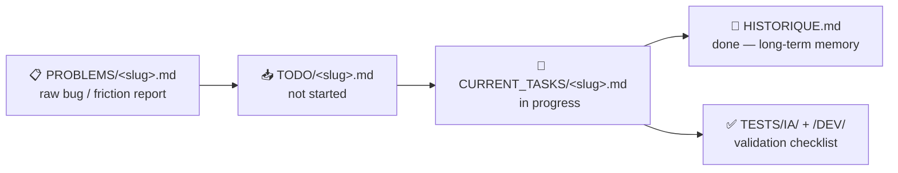

<div align="center">

# 🗂️ claude-crew

**File-based task lifecycle + multi-agent collision prevention for Claude Code.**

[](./LICENSE)
[](#-whats-in-the-box)
[](https://github.com/anthropics/claude-code)
[](https://github.com/Nakken13/organized)

**[Quick start](#-quick-start)** · **[How it works](#-how-it-works)** ·
**[Batching](#-the-actual-differentiator-batching)** ·
**[What's in the box](#-whats-in-the-box)** · **[Is this for you?](#-not-for-you-if)**

</div>

---

> [!TIP]
> Claude Code forgets everything between sessions. Run two instances on the
> same repo and they'll happily edit the same files at the same time, with no
> warning. `claude-crew` fixes both — with markdown files and two stdlib-only
> Python hooks. No server, no DB, no dashboard.
>
> **Install in one command, working in five minutes, nothing to host.**

<br>

## 🧩 The problem

| | |
|---|---|
| 🧠 **Session amnesia** | Every new Claude Code session starts blind: what's done, what's half-done, why a decision was made — gone unless you paste it back in yourself. |
| 💥 **Multi-agent collisions** | Parallelizing Claude Code (one instance per workstream) is the obvious way to go faster. It's also the fastest way to get two agents editing the same file at the same time, silently. |

<br>

## ⚙️ How it works

A task is a file. Its state *is* which folder it's in — no status field to
forget to update, `git mv` is the state transition:



A file is never in two folders at once. `git log --follow` on a task file is
its entire history.

<br>

## 🎯 The actual differentiator: batching

Plenty of scaffolds give you a prompt template and a folder layout. What
`claude-crew` adds is tracking *which files each task touches* (its "zone"),
grouping tasks that share a zone into the same batch, and flagging it —
before a task moves to `CURRENT_TASKS` — if its zone overlaps an **active**
batch it doesn't belong to. A routing rule tells Claude Code to check this
before starting any task, backed by a hook that re-checks and warns
(non-blocking, stderr) on every turn.

> [!IMPORTANT]
> You catch the collision **before** you point a second Claude Code instance
> at the same code, not after you've resolved the merge conflict.

```
🟢 Batch A — Zone: frontend/checkout/**        [1 task in CURRENT_TASKS]
🟢 Batch B — Zone: backend/payments/**         [1 task in CURRENT_TASKS]
🔴 Batch C — Zone: frontend/checkout/**  <-- overlaps Batch A, flagged before start
```

This is the part that matters once you're running more than one agent — the
folder lifecycle alone is a nice-to-have, the collision check is what keeps
parallel Claude Code instances from stepping on each other.

<br>

## 📦 What's in the box

| Piece | What it does |
|---|---|
| 🗂️ `crew/` | The task lifecycle folders (`PROBLEMS`/`TODO`/`CURRENT_TASKS`/`TESTS`/`CLAUDE_CONTEXT`/`ICEBOX`) |
| 🪝 `crew_hook.py` | Runs on `Stop` — regenerates `INDEX.md` files, warns (non-blocking, stderr) on zone overlaps and orphaned tasks |
| 🪝 `spec_to_task_hook.py` | Runs on file writes — keeps specs and tasks in sync |
| ⚡ `/crew-init` | Bootstraps the whole scaffold onto a project, resolves every `<placeholder>`, fails loud if one is left unresolved |
| ⚡ `/crew-new-task` `/crew-close-task` `/crew-status` | Run the lifecycle + batching instead of doing it by hand every time |
| 🎭 `.claude/agents/ceo.md` `manager.md` `comms.md` `architect.md` | Subagent personas routed by decision type — business/priority calls, task breakdown, user-facing copy, and structural tech choices don't get answered by the same voice that writes your diff |
| 📖 `CLAUDE.md` / `AGENTS.md` | Skill routing + context-efficiency rules (no reading 2000-line files whole) wired into Claude Code from day one |

Everything is plain markdown + JSON state — readable, greppable, diffable in
a normal PR review. No hosted board, no account, nothing to sync.

<br>

## 🚀 Quick start

```bash
git clone https://github.com/Nakken13/organized.git
cp -r organized/{CLAUDE.md,AGENTS.md,PRODUCT.md,CONTRIBUTING.md,SECURITY.md,crew,.claude} your-project/
```

Open `your-project` in Claude Code and run:

```
/crew-init
```

That's it — this detects your stack, resolves every `<placeholder>` with the
real repo info, and fails loud (`check_placeholders.py`) until nothing is
left unfilled. Full step-by-step in [`CLAUDE.md`](./CLAUDE.md).

Once it's running, three commands drive day-to-day work:

- ✨ `/crew-new-task` — create a task, auto-categorized into a batch
- ✅ `/crew-close-task` — close a finished task: checks, history, tests moved out
- 📊 `/crew-status` — read-only report: active batches, overlaps, orphaned tasks

<br>

## 🙅 Not for you if

> [!NOTE]
> - You're solo, one Claude Code session, small script — this is overhead you
>   don't need yet.
> - You want a hosted task board with a UI — this is deliberately local-first,
>   files-only, no service to run.

<br>

## 🤝 Contributing

Issues and PRs welcome — see [`CONTRIBUTING.md`](./CONTRIBUTING.md). If
`claude-crew` saves you a merge conflict, a ⭐ helps other people find it.

## 📄 License

MIT — see [`LICENSE`](./LICENSE).
