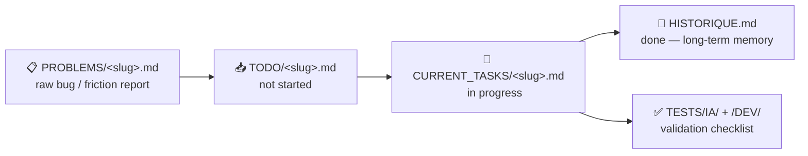

<div align="center">

# 🗂️ claude-crew

**File-based task lifecycle + multi-agent collision prevention for Claude Code.**

[](./LICENSE)
[](#-whats-in-the-box)
[](https://github.com/anthropics/claude-code)

**[Quick start](#-quick-start)** · **[How it works](#-how-it-works)** ·
**[Batching](#-the-actual-differentiator-batching)** ·
**[What's in the box](#-whats-in-the-box)** · **[Is this for you?](#-not-for-you-if)**

</div>

---

> [!TIP]
> Claude Code forgets everything between sessions. Run two instances on the
> same repo and they'll happily edit the same files at the same time, with no
> warning. `claude-crew` fixes both — with markdown files and two stdlib-only
> Python hooks. No server, no DB, no dashboard.
>
> **Install in one command, working in five minutes, nothing to host.**

<br>

## 🧩 The problem

| | |
|---|---|
| 🧠 **Session amnesia** | Every new Claude Code session starts blind: what's done, what's half-done, why a decision was made — gone unless you paste it back in yourself. |
| 💥 **Multi-agent collisions** | Parallelizing Claude Code (one instance per workstream) is the obvious way to go faster. It's also the fastest way to get two agents editing the same file at the same time, silently. |

> [!TIP]
> Recognize either of these? A ⭐ on [`claude-crew`](https://github.com/Nakken13/claude-crew) helps other people hitting the same wall find it.

<br>

## ⚙️ How it works

A task is a file. Its state *is* which folder it's in — no status field to
forget to update, `git mv` is the state transition:


```mermaid
flowchart LR
    A["📋 PROBLEMS/&lt;slug&gt;.md
    raw bug / friction report"] --> B["📥 TODO/&lt;slug&gt;.md
    not started"]
    B --> C["🚧 CURRENT_TASKS/&lt;slug&gt;.md
    in progress"]
    C --> D["📖 HISTORIQUE.md
    done — long-term memory"]
    C --> E["✅ TESTS/IA/ + /DEV/
    validation checklist"]
```

A file is never in two folders at once. `git log --follow` on a task file is
its entire history.

<br>

## 🎯 The actual differentiator: batching

Plenty of scaffolds give you a prompt template and a folder layout. What
`claude-crew` adds is tracking *which files each task touches* (its "zone"),
grouping tasks that share a zone into the same batch, and **preventing** —
not just flagging — a collision when a batch's zone overlaps an **active**
batch it doesn't belong to. Two layers, not one:

- **Layer 1 — physical isolation.** Each active batch runs in its own `git
  worktree` (`../<repo>-batch-<slug>/`, sibling of the main checkout) on its
  own branch (`crew/batch-<slug>`). Two Claude Code instances on two
  different batches are never pointed at the same working tree, so a raw
  filesystem collision between them is structurally impossible, not just
  discouraged.
- **Layer 2 — a blocking gate.** A `PreToolUse` hook intercepts every
  `Edit`/`Write`/`MultiEdit` call and every mutating `Bash` command
  (`rm`/`mv`/`cp`/output redirection/`git mv`) and **rejects it (`exit 2`)
  before it runs** if the path it touches falls under a `Zone:` already
  locked by a *different* session. The lock itself is registered
  preventively at the moment a task moves `TODO → CURRENT_TASKS` — including
  when that `git mv` is run from inside a batch worktree rather than the
  main checkout — written under a mutex with an atomic file replace, so two
  sessions racing to claim the same batch can't both win.

A `Stop` hook still regenerates `INDEX.md`/`BATCH_LOCKS.md` and re-checks
zone overlaps every turn, but now purely as a retroactive fallback (a
`git mv` run outside a tracked `Bash` call, or the `PreToolUse` gate getting
bypassed) — it's no longer the only thing standing between two agents and
the same file.

> [!IMPORTANT]
> You catch the collision **before** you point a second Claude Code instance
> at the same code — and if you somehow don't, the write itself gets
> refused instead of silently landing.

```
🟢 Batch A — Zone: frontend/checkout/**   [worktree ../repo-batch-a/, branch crew/batch-a]
🟢 Batch B — Zone: backend/payments/**    [worktree ../repo-batch-b/, branch crew/batch-b]
🔴 Batch C — Zone: frontend/checkout/**   <-- overlaps Batch A, write blocked (exit 2) before it happens
```

This is the part that matters once you're running more than one agent — the
folder lifecycle alone is a nice-to-have, the worktree isolation + blocking
gate is what actually keeps parallel Claude Code instances from stepping on
each other's files.

<br>

## 📦 What's in the box

| Piece | What it does |
|---|---|
| 🗂️ `crew/` | The task lifecycle folders (`PROBLEMS`/`TODO`/`CURRENT_TASKS`/`TESTS`/`CLAUDE_CONTEXT`/`ICEBOX`) |
| 🌳 Per-batch `git worktree` | Physical isolation — each active batch gets its own checkout (`../<repo>-batch-<slug>/`) and branch (`crew/batch-<slug>`), so parallel Claude Code instances can never share a working tree |
| 🪝 `crew_hook.py` | Two hooks in one file: `PreToolUse` blocks (`exit 2`) any `Edit`/`Write`/`MultiEdit`/mutating `Bash` into a zone locked by another session, and registers that lock preventively on `git mv`; `Stop` regenerates `INDEX.md`/`BATCH_LOCKS.md` and re-checks overlaps as a fallback |
| 🪝 `spec_to_task_hook.py` | Runs on file writes — keeps specs and tasks in sync |
| ⚡ `/crew-init` | Bootstraps the whole scaffold onto a project, resolves every `<placeholder>`, fails loud if one is left unresolved |
| ⚡ `/crew-new-task` `/crew-close-task` `/crew-status` | Run the lifecycle + batching instead of doing it by hand every time |
| 🎭 `.claude/agents/ceo.md` `manager.md` `comms.md` `architect.md` `designer.md` | Subagent personas routed by decision type — business/priority calls, task breakdown, user-facing copy, structural tech choices, and UX/retention/spec decisions don't get answered by the same voice that writes your diff |
| 🎭 `.claude/agents/ceo.md` `manager.md` `comms.md` `architect.md` `legal.md` | Subagent personas routed by decision type — business/priority calls, task breakdown, user-facing copy, structural tech choices, and legal risk (FR + international, framed as business trade-offs) don't get answered by the same voice that writes your diff |
| 📖 `CLAUDE.md` / `AGENTS.md` | Skill routing + context-efficiency rules (no reading 2000-line files whole) wired into Claude Code from day one |

Everything is plain markdown + JSON state — readable, greppable, diffable in
a normal PR review. No hosted board, no account, nothing to sync.

<br>

## 🚀 Quick start

Pick one — all three end up in the same place: `/crew-init` running against
your project.

### 🔌 Option A — Install via marketplace (recommended)

```
/plugin marketplace add Nakken13/claude-crew
/plugin install claude-crew@claude-crew
/crew-init
```

No cloning, no manual file copying — skills, agents, and hooks run straight
from the installed plugin.

### 🤖 Option B — Ask Claude to install it

Paste this into Claude Code, in the project you want to set up:

```
Install the claude-crew plugin (marketplace add Nakken13/claude-crew, then
install claude-crew@claude-crew), then run /crew-init here.
```

Claude runs the marketplace add + install for you, then bootstraps the
project the same way as Option A.

### 📋 Option C — Manual clone (no plugin system)

```bash
git clone https://github.com/Nakken13/claude-crew.git
cp -r claude-crew/{CLAUDE.md,AGENTS.md,PRODUCT.md,CONTRIBUTING.md,SECURITY.md,crew,.claude} your-project/
```

Open `your-project` in Claude Code and run `/crew-init`. Use this if you
don't want a marketplace dependency — everything (skills, agents, hooks)
gets copied straight into the project instead of running from an installed
plugin.

<br>

Whichever option you pick, `/crew-init` detects your stack, resolves every
`<placeholder>` with the real repo info, and fails loud
(`check_placeholders.py`) until nothing is left unfilled. Full step-by-step
in [`CLAUDE.md`](./CLAUDE.md).

Once it's running, four commands drive day-to-day work:

- ✨ `/crew-new-task` — create a task, auto-categorized into a batch
- ✅ `/crew-close-task` — close a finished task: checks, history, tests moved out
- 📊 `/crew-status` — read-only report: active batches, overlaps, orphaned tasks
- 🔄 `/crew-update` — pull engine-file changes into an already-bootstrapped project

<br>

## 🔄 Updating an existing project

Already bootstrapped? `/crew-update` pulls in engine-file changes (fixes,
new rules, new skills) without ever touching your `crew/` task data.

- **Plugin install (Option A/B)** — skills, agents, and hooks already run
  from `${CLAUDE_PLUGIN_ROOT}`, so `/plugin update claude-crew` covers those;
  `/crew-update` only checks `CLAUDE.md`/`AGENTS.md`/`PRODUCT.md`/
  `CONTRIBUTING.md`/`SECURITY.md`/`check_placeholders.py`.
- **Manual clone (Option C)** — `/crew-update` also checks `crew_hook.py`,
  `spec_to_task_hook.py`, and the local `.claude/skills/crew-*`/
  `.claude/agents/*` copies.

It never touches `crew/TODO/`, `crew/CURRENT_TASKS/`, `crew/PROBLEMS/`,
`crew/ICEBOX/`, `crew/TESTS/`, or `crew/CLAUDE_CONTEXT/HISTORIQUE.md`, and it
never silently overwrites a file you've personalized. Each engine file gets
one of four statuses before anything is written:

- `up_to_date` — nothing to do.
- `new` — added upstream, missing locally → created.
- `apply` — unchanged locally since the last update → safe to refresh.
- `conflict` — you've edited it since → shown as a diff, never overwritten
  without you saying so.

<br>

## 🙅 Not for you if

> [!NOTE]
> - You're solo, one Claude Code session, small script — this is overhead you
>   don't need yet.
> - You want a hosted task board with a UI — this is deliberately local-first,
>   files-only, no service to run.

<br>

## 🤝 Contributing

Issues and PRs welcome — see [`CONTRIBUTING.md`](./CONTRIBUTING.md). If
`claude-crew` saves you a merge conflict, a ⭐ helps other people find it.

[](https://github.com/Nakken13/claude-crew)

## 📄 License

MIT — see [`LICENSE`](./LICENSE).
